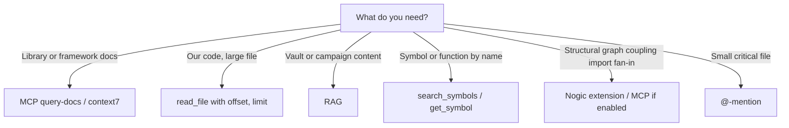

# Context Engineering

Effective context management for agentic AI. LLM context windows are finite; complex tasks require economical use of context.

**See also:** [INTENT_ENGINEERING.md](INTENT_ENGINEERING.md), [HANDOFF_FLOW.md](HANDOFF_FLOW.md), [NOGIC_WORKFLOW.md](../.cursor/docs/NOGIC_WORKFLOW.md) (graph/MCP vs symbol search), [state/README.md](../state/README.md).

---

## Six Context Components

| Component | Description |
|-----------|--------------|
| **User Message** | Initial input; continue prompt for new sessions |
| **System Prompt** | Rules, guardrails, role-routing, skills |
| **Tools** | Cursor tools + MCP |
| **Resources** | read_file, RAG, MCP fetch, vault |
| **Assistant Messages** | Chat history |
| **Tool Calls and Responses** | Intermediate tool history |

### Resources vs Tools

- **Resources** = data brought into context. The model reads and reasons over them.
- **Tools** = actions the model invokes. The host executes.

---

## Three Strategies for Economical Context Use

### 1. Data Retrieval

Use selective query methods. Retrieval routing:

- **Library/framework docs?** → MCP query-docs (context7)
- **Our code, large file (>10KB or >200 lines)?** → read_file(path, offset, limit)
- **Vault/campaign content?** → RAG
- **Symbol/function/class by name?** → jCodeMunch `search_symbols` → `get_symbol`
- **Structural graph / coupling / import fan-in?** → Nogic (extension + MCP if configured); see [NOGIC_WORKFLOW.md](../.cursor/docs/NOGIC_WORKFLOW.md)
- **Small critical file (<10KB)?** → @-mention

### Nogic vs jCodeMunch vs codebase_search

| Need | Prefer | Fallback |
|------|--------|----------|
| Structural graph, dependencies, what touches what | Nogic (graph / MCP when enabled) | jCodeMunch `get_repo_outline` → read_file |
| Symbol/function/class by exact or partial name | jCodeMunch `search_symbols` → `get_symbol` | grep → read_file |
| Broad “how does X work?” | codebase_search (narrow `target_directories`) | jCodeMunch outline → search_symbols |

**Summary:** Nogic answers **graph-level structure and coupling** (local index; optional MCP). jCodeMunch answers **symbols and outlines** by name. codebase_search answers **semantic** exploration—combine as needed; none replace tests or git.

### 2. Long-Horizon Thinking

#### Compaction

- **Handoff**: Done/Next bullets instead of full conversation.
- **Daily log**: Short blocks per session.
- **Tool output limits**: Cap terminal/grep output; read large files by range or tail.

#### Memory (Key-Value Store Outside Context)

- **handoff_latest.md**: What's next, what was done.
- **decision-log.md**: Decisions and rationale.
- **known-issues.md**: Gotchas.
- **preferences.md**, **rejection_log.md**: User preferences and rejections.
- **daily/YYYY-MM-DD.md**: Session summaries.
- **decision_index.md**: Rolling index of handoffs/decisions.

#### Composition

- **Subagents**: critic, verifier (separate context).
- **Skills**: planner, implementer, tech-lead, docs, qa-verifier.
- **Handoff chains**: Planner → Implementer → Critic; see [HANDOFF_CHAIN_PATTERNS.md](HANDOFF_CHAIN_PATTERNS.md).

---

## Harness as Performance Multiplier

The harness (surrounding infrastructure) often matters more than the model. The same model can score 78% vs 42% depending on harness. See [HARNESS_ARCHITECTURE.md](HARNESS_ARCHITECTURE.md) for lock-in and portability.

---

## Agent Checklist

- [ ] **Handoff?** If ~20–30 exchanges or context feels long, say "handoff" and start a new chat.
- [ ] **@-mention vs. selective read?** For large files: prefer read_file(path, offset, limit); reserve @-mention for small critical files.
- [ ] **Tool output limits?** Cap terminal/grep output; read large files by range or tail.
- [ ] **Every line earns its place:** In constraint docs, remove lines that would not change agent behavior.

---

## Repository-scale context (P2 — avoid unbounded @-files)

Survey-scale “whole repo” tasks are not solved by pasting entire trees into context. Prefer:

1. **Narrow `codebase_search`** with `target_directories` — not repo root by default.
2. **jCodeMunch** `search_symbols` / `get_symbol` for known APIs; **Nogic** (when enabled) for graph/coupling questions — see [.cursor/docs/NOGIC_WORKFLOW.md](../.cursor/docs/NOGIC_WORKFLOW.md).
3. **Handoff scope** — list allowed paths and must-not-touch paths; refresh intent when scope drifts.

Do **not** rely on huge @-mentions of generated or vendor dirs; use `.gitignore` and retrieval routing above. See [research/2511.18538-harness-gap-analysis.md](research/2511.18538-harness-gap-analysis.md) (context row).
