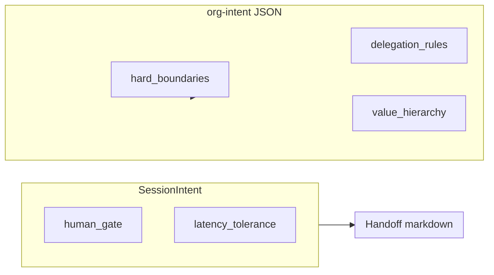
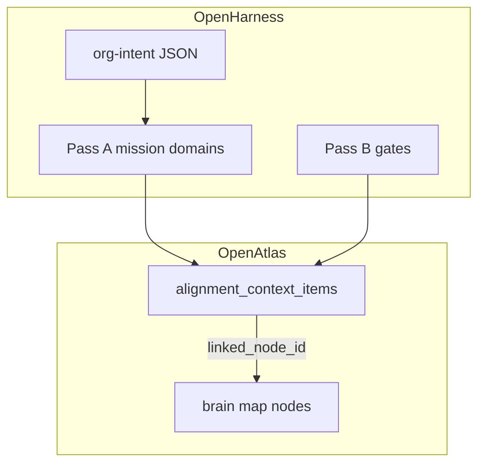
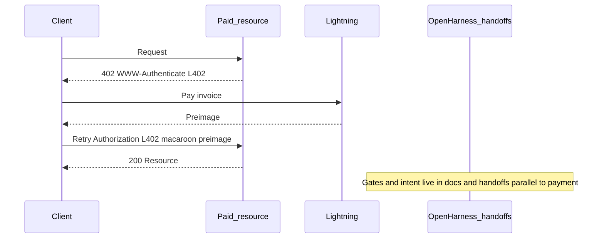

# Org-intent North Star and task-decomposition prompting

## What we're building (brainstorm scope)

- A **personal/org org-intent**: public example in-repo (schema-aligned, non-sensitive) plus **private** documentation (numbers, medical detail, keys, home-buying specifics).
- A **prompting pattern** so agents decompose work into tasks that respect **mission**, **quarterly outcomes**, **anti-goals**, and **trade-off rules**—not generic todo lists.
- **Pass C (OpenAtlas):** current projects, knowledge-base boundaries, and **linked_node_id** ties to the brain map so AI labor context stays structured and visualizable.
- **Pass D (Operational harness):** which skills/MCP are in scope, L402 / metering design questions (backlog), and **definition of done** by project type (verification + dual gates).

## Pass A — North star (draft for your revision)

### One-line mission (draft)

**Draft:** *Align open, verifiable human–AI collaboration with a sustainable creative life: ship alignment-adjacent open technology, practice glitch/3D art in a health-goth voice, and compound wealth through disciplined saving and asset ownership—without trading long-term health or integrity for short-term upside.*

Maps to: org-intent `mission` string + OpenHarness “intent” docs when you wire them.

### Ranked life domains (draft order — confirm or reorder)

**Soft rank (tie-break within week, after steering):** **Health → Wealth → Influence** — see Pass B. For narrative: body and mind as foundation; wealth as fuel for home and runway; influence as output of work and art, not vanity metrics.

**Quarters:** Use **calendar year** Q1–Q4 (January–December) for quarterly outcomes unless you later adopt a different convention in private docs.

| Domain | Quarterly measurable outcome (example shape) | Anti-goal (what success is *not*) |
|--------|-----------------------------------------------|-----------------------------------|
| **Wealth** | e.g. track savings rate + one asset milestone (e.g. emergency fund band, down-payment sub-account contribution) | Living ostentatiously; chasing yield without understanding risk; letting “build” justify chronic undersleep |
| **Health** | e.g. strength metric + adherence (sessions/week, protein target days/week) | Orthorexia or perfectionism; comparing to arbitrary aesthetics; injury from ego lifting |
| **Influence — art** | e.g. N portfolio pieces, prints, or public creative releases in your voice | Engagement farming; abandoning craft for volume; aesthetic comparison spirals; **manipulation or coercive UX** in comms tied to creative work |
| **Influence — open source** | e.g. N alignment-adjacent repo releases, docs, or merged contributions | Techno-solutionism; shipping without review; scope creep that trades away health or integrity; **dark patterns** or **deceptive** “adoption” metrics in docs or tooling |
| **Influence — collective** | e.g. scoped milestones for Fedimint-style or communal experiments (measurable, time-bound) | Promising collective outcomes before grounded milestones; binding shared commitments without `sync` gates; **pressure tactics** or obscured risk in onboarding |

**Soft-rank note:** The within-week tie-break **Health → Wealth → Influence** applies at the **parent** level (Influence = creative + technical + collective output combined). When weekly steering is silent on a micro-decision *between* art vs open source vs collective, treat that as an **escalate** or explicit weekly choice—do not let agents invent a default order among the three Influence lanes.

### Trade-off rule (resolved)

**Decision:** There is **no fixed default** between domains when they collide. **Trade-offs are settled by explicit weekly human choice.** The stack is a **consulting and feedback system**: agents surface conflicts, options, and consequences; you choose for that week; the choice is logged as context for the next decomposition (not buried in silent hierarchy).

**Encode in org-intent:** Use `value_hierarchy.conflicts` with a rule like: *when domains conflict, escalate to weekly human review; do not infer priority without recorded human choice for the period.* Optional: add a `delegation_rules` row for *period_budget_review* → `escalate`.

**Prompt pattern:** End-of-week (or start-of-week) short session: “Given last week’s outcomes, which domain gets emphasis this week?” → feed answer into the next task-decomposition prompt as a one-line **weekly steering constraint**.

### Leading / lagging / anti-metrics (per domain)

Use this sub-table to reduce **Goodhart** risk: **leading** = processes you control this week; **lagging** = outcomes that move slowly; **anti-metrics** = things you refuse to optimize even if they move.

| Domain | Leading indicators (examples) | Lagging indicators (examples) | Anti-metrics (“we will not chase…”) |
|--------|------------------------------|-------------------------------|-------------------------------------|
| **Wealth** | Savings rate tracked; contribution calendar followed | Net worth band; milestone sub-account balance | Raw “returns” bragging; yield chasing without education |
| **Health** | Sessions/week; sleep floor; protein adherence | Strength PR; body comp trend (private) | Vanity scale; comparison to strangers’ aesthetics |
| **Influence — art** | Studio hours; drafts completed; shipping cadence | Exhibitions/sales (if applicable) | Follower count; pure engagement rate |
| **Influence — open source** | PRs merged; issues triaged; docs revisions | Stars/downloads (informational only) | Merge count without review quality |
| **Influence — collective** | Scoped calls; milestone demos; documented decisions | Community health (lagging) | Headline “growth” without safety milestones |

### Goodhart shield (questionnaire block)

Ask at intake and re-check quarterly:

- **What would look like success but would actually violate your values?** (Captures proxy traps before dashboards exist.)

### Task leaves: metric-class tagging

When decomposing work, tag each **leaf task** with **which metric class** it serves: **leading**, **lagging**, **guardrail** (anti-goal preservation), or **non-metric** (pure maintenance). If only **lagging vanity** metrics would move, flag **metric gaming risk** for human review before shipping the plan.

## Pass B — Constraints and gates

Pass B maps **OpenHarness intent** ([INTENT_ENGINEERING.md](../INTENT_ENGINEERING.md): `constraints`, `human_gate`, `latency_tolerance`) to **org-intent** (`hard_boundaries`, `delegation_rules`, `value_hierarchy`, `values`) and to **session handoffs**. See also [AUTHORITY_MODEL.md](../AUTHORITY_MODEL.md) for cryptographic vs social authority.

### Soft rank (resolved)

**Within-week tie-break** (only when weekly steering is silent on a micro-decision): **Health → Wealth → Influence**. This does **not** override explicit weekly human choice; it breaks ties so agents do not invent a default.

### Crosswalk: INTENT_ENGINEERING ↔ org-intent

| INTENT_ENGINEERING | org-intent / practice |
|--------------------|------------------------|
| **Musts** | `values` entries (e.g. `MUST: …`) and, where safe, `delegation_rules` with `action: proceed` |
| **Must-nots** | `values` + documented must-nots; violations = constraint breach, escalate |
| **Escalation triggers** | `hard_boundaries[]` (`id`, `description`, `trigger`) |
| **Preferences** | Brainstorm or `values`; lower priority than must-nots |
| **human_gate** (string) | Not a schema field: **named gates** in handoffs; mirror critical gates with `delegation_rules` → `escalate` |
| **latency_tolerance** | Not a schema field: set on each handoff; default `async_ok` per INTENT_ENGINEERING; `sync` when human must approve before continue |

`human_gate` and `latency_tolerance` belong in **session briefs and handoffs**, not inside org-intent JSON (unless the spec is extended later).

### Handoff fields (copy pattern)

- Default **`latency_tolerance: async_ok`** for handoff chains (drafts, research, local work).
- Set **`latency_tolerance: sync`** when the human must approve **before** the next agent action: legal/financial binding steps, irreversible infra, crossing a `hard_boundary`, key-handling, first-time collective or Fedimint commitments, publishing security- or reputation-critical claims.
- Set **`human_gate`** to a short id (e.g. `approval_before_public_commit`) matching your delegation rule.

### Sync vs async (action classes)

| Latency | Use when (examples) |
|---------|---------------------|
| **`sync`** | Legally or financially binding commits; irreversible production changes; any action that trips a **hard_boundary**; cryptographic key operations; public claims about security, compliance, or third parties; first-time participation in a collective or Fedimint arrangement; external comms that imply org endorsement |
| **`async_ok`** | Research, drafts, local branches, plans, reviews, refactors under scope — per INTENT_ENGINEERING default for handoff chains |

Add private edge cases (employer, NDA, jurisdiction) in your private doc only.

### Legal, contractual, and reputational lines

**Feeds `hard_boundaries` (generic public wording):** no professional legal or regulatory advice; no warranty that a design fits a jurisdiction; no commitment on behalf of another person or entity without verifiable authorization; no deceptive or overstated claims about AI or agent capabilities; no laundering reputational risk onto others.

**Feeds `delegation_rules`:** ambiguous liability → escalate; external attribution of the org or mission → escalate; unclear scope for communal or economic experiments → escalate.

Employer, contract, and jurisdiction specifics stay in **private** documentation.

**Regulatory honesty (v1 public bar):** Operate **legally** in relevant jurisdictions; be **pro-social** and **collaborative** (credit others, avoid laundering risk or bad-faith framing). This is the stated public posture for mission and examples—it is **not** a substitute for professional legal, regulatory, financial, or medical advice (see hard_boundaries above).

### Must / must-not / escalation (draft placeholders — edit freely)

**Must (examples):**

- State uncertainty where claims are not evidence-backed.
- Prefer reversible changes until a human gate clears irreversible steps.
- Align task decomposition with recorded weekly steering when present.
- Separate public example artifacts from private operational detail.

**Must-not (examples):**

- Skip human gates when `latency_tolerance` is `sync` for that action class.
- Store or transmit private keys or raw PII inside org-intent JSON or public repos.
- Promise outcomes for Fedimint, mesh, or collective systems without scoped milestones.
- Present consulting feedback as medical, legal, or financial advice.

**Escalation triggers (examples):**

- Goal and stated constraint conflict (per INTENT_ENGINEERING).
- Any `hard_boundary` trigger matches.
- Weekly steering absent and domain tie-break is insufficient for the decision.
- Reputational, legal, or safety impact is unclear.

## Pass C — Context for AI labor (OpenAtlas + brain map)

Pass C is **operational context** for AI labor: what you are working on, where knowledge lives, and what must never be automated. It maps to **OpenAtlas** `alignment_context_items` (HTTP API: [ALIGNMENT_CONTEXT_API.md](../../../portfolio-harness/OpenAtlas/docs/agent/ALIGNMENT_CONTEXT_API.md)). Canonical fields for this pass: **`title`**, **`body`**, **`tags`**, optional **`linked_node_id`**, plus `status`, `priority` per the API.

OpenAtlas runs in **portfolio-harness** (see [openharness README](../../README.md) “OpenAtlas”); OpenHarness holds this brainstorm. Flow: Pass A/B set mission and gates; Pass C keeps **current labor** and **KB boundaries** in sync with visualization.

### C.1 Inventory tables (templates — fill private copy)

**Projects / repos / teams / tools** (public brainstorm: placeholders only; no secrets):

| Name | Role | Repo path or URL | Owner | Notes |
|------|------|------------------|-------|-------|
| *(example)* OpenHarness | Intent + docs | `D:/openharness` | self | North star brainstorm |
| *(example)* portfolio-harness | Harness + OpenAtlas | `D:/portfolio-harness` | self | Alignment API + UI |
| *TBD* | | | | |

**Knowledge bases by domain:**

| Domain | Location (vault / repo / OpenAtlas-only) | Refresh cadence | Agent may read | Human-only |
|--------|-------------------------------------------|-----------------|----------------|------------|
| Alignment / agent tooling | e.g. `openharness/docs`, org-intent examples | weekly | yes | key material, prod secrets |
| Fedimint / mesh / collectives | e.g. research notes, specs | monthly | yes | binding commitments |
| Personal health / training | private vault | weekly | summaries only | full medical, diet detail |
| Art / 3D / portfolio | repo or drive | per release | public refs | unreleased WIP if sensitive |
| Finance / home | private doc | monthly | aggregates only | account numbers, offers |

### C.2 Explicitly out of scope for automation

Aligned with Pass B: agents **do not** autonomously handle **medical diagnosis or treatment planning**, **binding legal or financial decisions**, **relationship-sensitive** content, or **unreleased IP** you mark human-only. Those stay **escalate** / `sync` gates. When in doubt, treat as human-only and patch alignment items to say so.

### C.3 Mapping to OpenAtlas: `body`, `tags`, `linked_node_id`

| Concept | How to encode |
|---------|----------------|
| Domain / labor lane | `tags`: e.g. `domain:health`, `domain:wealth`, `domain:influence`, `repo:openharness`, `tool:mcp` — keep a stable prefix convention |
| Rich context | `body`: short markdown (active projects, blockers, pointers to handoff files or paths) |
| Graph / visualization | `linked_node_id`: string ID of the **brain-map** node for this item (same ID space the viewer uses); mint IDs in one place (e.g. export from brain map or OpenAtlas admin) |
| Lifecycle | `status`: `draft` \| `active` \| `archived`; `priority` optional integer |

Prefer **one alignment item per project or domain slice** so `tags` and `linked_node_id` stay meaningful; avoid a single megabyte `body` mixing unrelated labor.

### C.4 Brain map and intent

**Why `linked_node_id`:** Intent and labor context stay **anchored** in the graph: when `body` or `tags` change, the visualization node does not drift. Agents should **PATCH** alignment items ([ALIGNMENT_CONTEXT_API.md](../../../portfolio-harness/OpenAtlas/docs/agent/ALIGNMENT_CONTEXT_API.md)) instead of pasting duplicate graph state into every prompt.

Brain-map JSON shape used in tests (reference only): [context-atlas.spec.ts](../../../portfolio-harness/OpenAtlas/e2e/context-atlas.spec.ts).

### Agent-native discipline (Pass C)

- **Context injection:** Session briefs or handoffs should reflect **active** alignment context (e.g. `GET /api/alignment-context?status=active` with `x-alignment-context-key` when configured) so labor and domains are visible without guessing.
- **Parity:** Same contract for operators (admin UI) and agents — [alignment-context-cli.mjs](../../../portfolio-harness/OpenAtlas/scripts/alignment-context-cli.mjs); see [MCP_CAPABILITY_MAP.md](../../../portfolio-harness/.cursor/docs/MCP_CAPABILITY_MAP.md) (OpenAtlas / Brain Map).
- **Granularity:** Atomic items + clear tags preserve composability (update one lane without rewriting everything).

## Pass D — Operational harness (OpenHarness + L402 + tools)

Pass D ties **how agents run** to **what “done” means**: documented tool scope, payment/metering questions left as explicit backlog (no fake precision), and verification aligned with CI and OpenHarness gates.

### D.1 Role in the stack

- **OpenHarness:** Intent docs, session handoffs, and gates ([INTENT_ENGINEERING.md](../INTENT_ENGINEERING.md): `constraints`, `human_gate`, `latency_tolerance`); authority framing in [AUTHORITY_MODEL.md](../AUTHORITY_MODEL.md).
- **Tools / MCP:** Where operator parity matters, agents use the **same** contracts as humans (Pass C: alignment context API, CLI, MCP map). The harness is **documented capability**, not “every MCP installed everywhere.”

### D.2 Skills / MCP in scope (template)

Curate a minimal default set per repo; mark the rest TBD until needed.

| Capability | In scope | Notes |
|------------|----------|--------|
| OpenAtlas alignment context + brain map | Y (when using OpenAtlas) | [MCP_CAPABILITY_MAP.md](../../../portfolio-harness/.cursor/docs/MCP_CAPABILITY_MAP.md); [alignment-context-cli.mjs](../../../portfolio-harness/OpenAtlas/scripts/alignment-context-cli.mjs) |
| SCP / provenance (Bitcoin-sourced or untrusted content) | Y (when applicable) | Per portfolio [BITCOIN_AGENT_CAPABILITIES.md](../../../portfolio-harness/docs/BITCOIN_AGENT_CAPABILITIES.md) and SCP gate before feeding chain data to LLM state |
| Browser automation (smoke / review) | TBD | Enable when UI or E2E workflows are in scope |
| Git (status, diff, commit) | TBD | Often via agent or IDE; align with human-gated pushes |
| Project-specific MCPs | TBD | List in `AGENTS.md` or repo README when frozen |

**Intent:** Freeze a **default harness** vs **on-demand** tools without implementing billing or full metering yet.

### D.3 L402 / budget / metering (design-time only)

Canonical protocol comparison and flows: [CASHU_L402_REFERENCE.md](../../../portfolio-harness/docs/CASHU_L402_REFERENCE.md) (macaroon + preimage, `WWW-Authenticate`, Cashu vs L402, retry headers).

**Open design questions (backlog):**

- **Who pays:** Human operator vs org budget vs per-project wallet; prepaid balance vs strict pay-per-request.
- **Which endpoints:** Which HTTP surfaces (OpenAtlas API, future agent proxy, third-party tools) are payment-gated vs free tier.
- **Preimage / retry flow:** How the client obtains the invoice, pays Lightning, and retries with `Authorization: L402 <macaroon>:<preimage>`; macaroon caveats and rotation policy.
- **Metering unit:** Per request, per token, per session—align with observability and budgets later.

**L402-related code** is not “done” until the payment path is **testable in staging** (even if manual); defer claiming completion until an implementation ticket exists.

### D.4 Definition of done by project type

Align local “done” with CI where the repo has workflows ([VERIFICATION_CI_ALIGNMENT.md](../../../portfolio-harness/docs/VERIFICATION_CI_ALIGNMENT.md)).

| Project type | Minimum bar |
|--------------|-------------|
| **Docs-only** (single file, low stakes) | Human read; link check if adding paths |
| **Docs multi-file / normative** | Same + **critic JSON** per [critic-loop-gate.mdc](../../.cursor/rules/critic-loop-gate.mdc) (or workspace copy of the rule) |
| **Code / config** | **Tests + lint + typecheck/build** as applicable for that package; UI changes add smoke or browser review when the repo expects it |
| **Substantive multi-file / high-stakes** | **Critic JSON + intent-alignment JSON** ([intent-alignment-gate.mdc](../../.cursor/rules/intent-alignment-gate.mdc)); handoff block per [HANDOFF_FLOW.md](../HANDOFF_FLOW.md) when the session changed code |

## Why this matters for prompting

Task decomposition fails when the model optimizes for “productivity” without **your** steering. The org-intent file gives machine-readable anchors; Pass A gives quarterly outcomes; the **weekly human choice** prevents silent automation of values. Agents **consult** (options, trade-offs) and **reflect** (feedback on what happened vs plan)—they do not **substitute** for the weekly adjudication between domains.

## Approaches to “best prompt” for task-decomposed solutions

### Approach A — Intent-first WBS (recommended to start)

**Description:** Every decomposition starts by loading **mission + ranked domains + active quarter outcomes + anti-goals + this week’s explicit human steering** (from the consulting/feedback loop). The model outputs a WBS where each leaf task tags which domain it serves and which anti-goal it avoids; if a conflict is unresolved, it outputs **options + recommendation** and flags **weekly review**, not a fake default.

**Pros:** Simple; matches existing org-intent schema; easy to audit.  
**Cons:** You must refresh quarterly outcomes manually.  
**Best when:** You want one workflow for life + tech without over-engineering.

### Approach B — Dual intent: `personal` vs `org` JSON

**Description:** Two org-intent files (or sections): one for embodied life (health, wealth, art cadence) and one for cryptography/Fedimint/agent-identity. A “merge prompt” defines cross-links and conflict rules.

**Pros:** Clear separation of sensitive vs public; public repo only sees org/tech example.  
**Cons:** More maintenance; merge conflicts in meaning if not synced.  
**Best when:** Private repo or encrypted vault holds personal intent; public harness holds technical mission.

### Approach C — Hard-boundary gates before decomposition

**Description:** Before any task breakdown, run a short check: *Does this plan violate stated anti-goals or hard_boundaries?* If yes, stop and revise (analogous to hb-1 / hb-2 in `org-intent.example.json`).

**Pros:** Reduces “hustle culture” drift; aligns with OpenHarness authority model.  
**Cons:** Extra step; can feel heavy for tiny tasks.  
**Best when:** High-stakes weeks or when you’re prone to overcommitting.

**Recommendation:** Start with **A + C** (lightweight): one pasted block at the top of decomposition prompts, plus a three-line boundary check. Add **B** when you split public/private files.

## Repo alignment (existing artifacts)

- Intent schema and Pass B mapping: [INTENT_ENGINEERING.md](../INTENT_ENGINEERING.md) (`constraints`, `human_gate`, `latency_tolerance`)
- Examples: `portfolio-harness/org-intent-spec/examples/org-intent.example.json`, `org-intent.consulting-feedback.example.json` (Pass B–style gates; sanitized)
- Schema: `portfolio-harness/org-intent-spec/schema/org-intent.v1.json`
- Authority framing: [AUTHORITY_MODEL.md](../AUTHORITY_MODEL.md) (cryptographic vs social authority; pseudoanonymous audit)
- **Pass C / OpenAtlas:** [ALIGNMENT_CONTEXT_API.md](../../../portfolio-harness/OpenAtlas/docs/agent/ALIGNMENT_CONTEXT_API.md) (`body`, `tags`, `linked_node_id`, CRUD); operator map: [MCP_CAPABILITY_MAP.md](../../../portfolio-harness/.cursor/docs/MCP_CAPABILITY_MAP.md) (OpenAtlas / Brain Map); CLI: [alignment-context-cli.mjs](../../../portfolio-harness/OpenAtlas/scripts/alignment-context-cli.mjs)
- **Pass D / L402 + verification:** [CASHU_L402_REFERENCE.md](../../../portfolio-harness/docs/CASHU_L402_REFERENCE.md); [VERIFICATION_CI_ALIGNMENT.md](../../../portfolio-harness/docs/VERIFICATION_CI_ALIGNMENT.md); dual gates: [intent-alignment-gate.mdc](../../.cursor/rules/intent-alignment-gate.mdc), [critic-loop-gate.mdc](../../.cursor/rules/critic-loop-gate.mdc); handoffs: [HANDOFF_FLOW.md](../HANDOFF_FLOW.md)

Public examples omit PII and exact financial figures; private doc holds personal health, income, and key material.

## Open questions

None at present — see **Resolved questions** below.

## Resolved questions

- **Trade-offs between domains (health / wealth / influence):** **Explicit weekly human choice.** System is **consulting and feedback**, not an automated default hierarchy. Encode as escalate + weekly steering input to prompts.
- **Soft rank (within-week tie-break):** **Health → Wealth → Influence** when weekly steering does not resolve a micro-decision. Does not override weekly human choice (Pass B).
- **Influence sub-outcomes:** **Three lanes under Influence** (same parent domain; separate quarterly outcomes): **art / public creative output**, **open-source / alignment-adjacent shipping**, **Fedimint-style collective / communal experiments** (see Pass A table). Micro-conflicts between lanes escalate or go to weekly steering—no agent-invented default order.
- **Regulatory honesty (v1 public mission):** **Operate legally**; be **pro-social** and **collaborative**; do not substitute this posture for professional advice—see Pass B “Legal, contractual…” and **Regulatory honesty** paragraph.
- **Quarter calendar:** **Calendar year** Q1–Q4 (January–December).

## Section 6 — Critic engagement (see also)

Normative mitigations and rolling **critic log** (gates, L402 commercial backlog, sync policy, privacy, survey mapping, knowledge bundles, approval defaults):

- [critic-log-org-intent.md](../critic-log-org-intent.md)
- [PRECEDENCE_AND_STEERING.md](../PRECEDENCE_AND_STEERING.md)

Machine-readable ethics additions for org-intent examples: `portfolio-harness/org-intent-spec/examples/org-intent.consulting-feedback.example.json` (`hb-ethics-*` boundaries).
