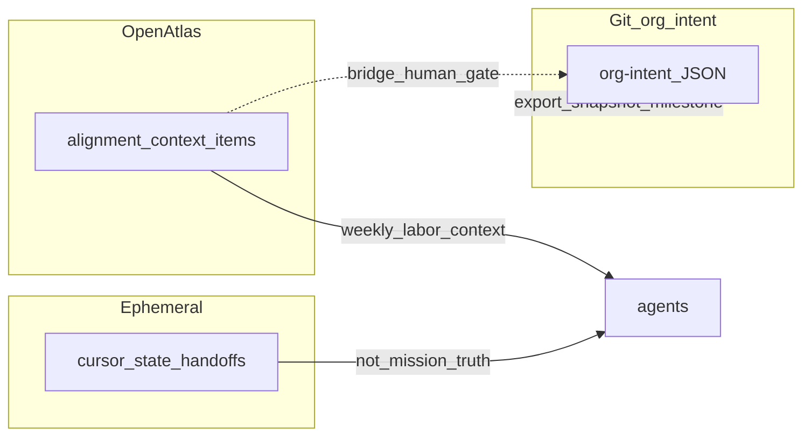

# Critic log — org-intent and north-star mitigations

Rolling **risk / mitigation / residual / next experiment** for themes tied to [2026-03-22 org-intent north-star brainstorm](brainstorms/2026-03-22-org-intent-north-star-brainstorm.md). Complements **dual gates**: [critic-loop-gate.mdc](../.cursor/rules/critic-loop-gate.mdc) (artifact quality) and [intent-alignment-gate.mdc](../.cursor/rules/intent-alignment-gate.mdc) (fit to intent and constraints).

### Embedding governance text in LLM prompts

When this doc, org-intent JSON, or other **static governance** is injected into model context, **tag the source** so it is not blended with user or tool content (reduces prompt-injection / instruction-conflict risk). Prefer patterns such as: `SOURCE: static governance (non-user)`; wrap pasted blocks in clear delimiters; treat **org-intent JSON** as the machine-enforced policy where your runtime supports it, and treat markdown as **non-authoritative** unless merged through a gated pipeline. See also [INTENT_ENGINEERING.md](INTENT_ENGINEERING.md).

---

## 6.1 Discipline — gates and logs

### When to use which gate

| Gate | Question | Typical trigger |
|------|----------|-----------------|
| **Critic JSON** | Is the artifact good enough (completeness, imports, coherence)? | Multi-file docs, normative rules, code/UI batches per Pass D DoD table in brainstorm |
| **Intent-alignment JSON** | Does the output match stated intent, scope, and constraints? | Drift, scope creep, skipped `human_gate`, goal–constraint conflict |

**Calibration:** Run **intent-alignment** when constraints matter—not for every routine trade-off discussion. Tune **drift_score** so **unresolved value conflict** (domains, ethics, commercial posture) trips escalation, not ordinary prioritization dialogue.

### Artifact vs process rule

Each critique should yield **one** concrete outcome: either an **artifact** (boundary text, questionnaire item, sync policy paragraph, org-intent `values` / `hard_boundaries`) or a **process** (e.g. quarterly anti-metric review).

### Critic log table (maintain over time)

| Theme | Risk | Current mitigation | Residual risk | Next experiment |
|-------|------|--------------------|---------------|-----------------|
| Goodhart / shallow metrics | Optimizing proxies that harm values | Leading/lagging/anti-metrics in Pass A; Goodhart shield question | Vanity dashboards still seductive | Quarterly anti-metric vs dashboard review |
| Precedence ambiguity | Agents infer domain order | Weekly steering + soft-rank doc | Silent defaults in novel situations | Add one escalation example to handoff template |
| Influence ethics | Manipulation, dark patterns | org-intent ethics `hard_boundaries`; Pass A anti-goals | Third-party comms not covered | Extend review checklist for external posts |
| L402 / commercial | Liability after payment | Design-time backlog + risk register below | No staging tests yet | Ticket payment-path smoke when implemented |
| Dual source of truth | Git vs DB vs state disagree | Policy in §6.6 below | Drift between exports | Milestone export script |
| Privacy / logs | Over-collection | Short policy §6.7 | Employer/jurisdiction variance | Tag PII fields in log schema when built |
| Survey mismatch | Pedagogical vs strategic conflation | Mapping table §6.8 | Two UIs to maintain | Single entry router copy |
| Knowledge bundles | Stale taxonomy | Owner/version/review §6.9 | Orphan nodes | Deprecation sweep in brain map review |
| Approval bottleneck | Sync on everything | Default `async_ok`; batch weekly §6.10 | Approval debt | Time-box weekly review |

---

## 6.5 L402 / commercial intent (questionnaire backlog)

Capture before treating L402 as “in scope” for implementation:

- **Posture:** Hobby / personal automation vs **productized API** (paid third-party access).
- **Merchant of record:** Who is the counterparty for paid calls (you, org, platform)—if any.
- **Refunds / disputes:** None, best-effort, or policy TBD; align with reputation `hard_boundaries`.
- **Budget:** Human wallet vs org budget vs per-project float.

### Risk register (non-exhaustive)

| Risk | Mitigation direction |
|------|----------------------|
| **Preimage expiry** before retry | Client retry policy; clear UX; log challenge id |
| **Retry / attention economics** | Metering unit choice; caps; async handoff when human must fund |
| **Bad tool output after payment** | Disclaimers; escalation path; sync gate for high-stakes tools; no warranty of correctness in public bar |

Design references: [CASHU_L402_REFERENCE.md](../../portfolio-harness/docs/CASHU_L402_REFERENCE.md), Pass D in north-star brainstorm.

---

## 6.6 Dual source of truth

| Layer | Canonical role |
|-------|------------------|
| **Git (org-intent JSON)** | **Audit** truth: versioned, taggable; material changes may use signed tags. |
| **OpenAtlas `alignment_context_items`** | **Runtime** labor context: what agents load **this week** (Pass C). |
| **`.cursor/state`** | **Session / ephemeral**: handoffs, preferences—not long-term mission truth. |
| **Bridge** | **Export** (alignment → markdown/JSON in repo) on schedule or milestone for audit; **import** into mission-bearing files only with **`human_gate`**. |

**OpenAtlas approach B (dedicated table):** Operational source for live alignment is the DB/API; git holds **audit snapshots** when you export. Treat drift as expected unless you automate export.

---

## 6.7 Privacy and logs

- **What to log:** Prefer tool names, outcomes, and decision ids over raw prompts where possible; when prompts are logged, scope **PII** and secrets policies.
- **Retention:** Define max age or rotation for agent/operator logs; stricter for rich transcripts.
- **Access:** Who can read logs (operator-only vs org); separate **dev** vs **prod** sinks.
- **Gates:** Tie **rich logs** and sensitive content to **`sync`** / explicit **`human_gate`** per [INTENT_ENGINEERING.md](INTENT_ENGINEERING.md).

Pair detailed employer, NDA, and jurisdiction rules with **private** docs—not public org-intent.

---

## 6.8 Survey mapping (strategic vs pedagogical)

OpenAtlas [survey types](../../portfolio-harness/OpenAtlas/src/types/survey.ts) (learning style, peak performance, etc.) serve **intake / UX**; **strategic intent** seeds org-intent and alignment context with different semantics.

| Option | Detail |
|--------|--------|
| **A** | **Separate wizard** for strategic intent / org-intent seeds—distinct fields from pedagogical survey. |
| **B** | Same app, **two flows**; share storage only where field names match alignment schema. |

**Mapping table (each question row):**

| Question / block | `alignment_context_items` | org-intent file | Both |
|------------------|---------------------------|-----------------|------|
| Weekly steering emphasis | Y (tags: `weekly_steering`) | — | Optional summary in `values` |
| Domain quarterly outcomes | Y | Mirror in private doc; public example in repo | Public sanitized |
| Goodhart shield answer | Y | — | — |
| Pedagogical learning style | Y (demo) | — | — |

Avoid mixing **pedagogical** answers into **mission** JSON without explicit mapping.

---

## 6.9 Knowledge bundles / taxonomy

For brain-map or template graphs:

- **Owner:** Role or human responsible for updates.
- **Version:** Semver or date stamp.
- **Last reviewed:** Date; stale nodes require freshness signal in `body` or tags before agents treat as authoritative.
- **Deprecation:** Path for superseded bundles (redirect tag, archive status).

---

## 6.10 Approval bottleneck

- **Default:** `latency_tolerance: async_ok` for handoff chains per [INTENT_ENGINEERING.md](INTENT_ENGINEERING.md).
- **`sync`:** Binding, irreversible, `hard_boundary`, key-handling, first-time collective commitments—per Pass B in north-star brainstorm.
- **Process:** Batch weekly review where possible; treat chronic **approval debt** as harness mis-tuning (too many `sync` gates or unclear scope).

---

## See also

- [PRECEDENCE_AND_STEERING.md](PRECEDENCE_AND_STEERING.md) — macro weekly vs micro soft-rank vs escalate
- [INTENT_ENGINEERING.md](INTENT_ENGINEERING.md) — intent schema, human gate protocol
