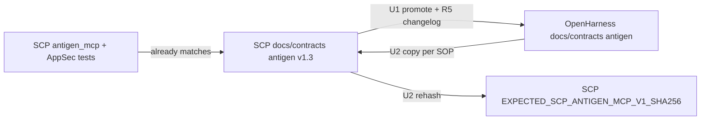

# Align antigen MCP contract with hardened SCP

## Goal Capsule

**Objective:** Make OpenHarness `docs/contracts/scp_antigen_mcp_v1.md` normative again by promoting the hardened SCP vendor text (already at Version 1.3), closing the three audit gaps (MCP DEV_AUTO, MCP `tls_verify`, dual-gate consent), then re-sync SCP vendor + hash pin so both repos agree.

**Authority:** SCP `antigen_mcp.py` + AppSec tests are behavioral source of truth; OpenHarness contract is public normative home per `SCP/docs/OPENHARNESS_CONTRACT.md`.

**Stop when:** OH and SCP antigen contract files are byte-identical (UTF-8, LF), hash test pins match, and grep gates for the three findings pass on the OH file.

---

## Product Contract

### Summary

Operators and downstream MCP implementers must not be told that agents can disable TLS verify, use DEV_AUTO under MCP, or merge/publish with `approve=true` alone. OpenHarness currently ships stale antigen v1.0; SCP already vendors corrected v1.3. This work restores OH→SCP sync discipline without softening SCP runtime.

### Requirements

- R1. Antigen contract documents that `SCP_REGISTRY_MERGE_DEV_AUTO` does **not** apply under MCP (CLI-only / ignored when MCP transport active).
- R2. Antigen contract lists **no** MCP `tls_verify` parameter; registry TLS is env-only via `SCP_REGISTRY_TLS_VERIFY` (and related antigen TLS env as already in vendor).
- R3. Antigen contract documents dual-gate merge/contribute/publish: tool `approve=true` **plus** required operator consent env vars (`SCP_REGISTRY_MERGE_CONSENT`, `SCP_CONTRIBUTE_CONSENT`, `SCP_ANTIGEN_PUBLISH_CONSENT` as applicable).
- R4. OpenHarness and SCP vendored `docs/contracts/scp_antigen_mcp_v1.md` are byte-identical after sync; SCP `EXPECTED_SCP_ANTIGEN_MCP_V1_SHA256` matches that content.
- R5. In-file Version / Changelog honestly reflect the promoted revision (Version **1.3** with a **1.3** changelog bullet — vendor currently headers 1.3 but changelog tops at 1.2).

### Actors

- A1. Operator configuring MCP / consent env
- A2. Implementer vendoring the OpenHarness contract hash
- A3. Reviewer verifying AppSec parity before merge

### Key Flows

- F1. Promote hardened contract text into OpenHarness, then copy OH → SCP per existing sync SOP.
- F2. Recompute SHA-256; update SCP hash pin; run contract hash tests.

### Acceptance Examples

- AE1. OH antigen contract has no `tls_verify` in the `scp_fetch_registry` parameter column; mentions `SCP_REGISTRY_TLS_VERIFY`.
- AE2. `scp_apply_registry_quarantine` human-gate text states DEV_AUTO disabled under MCP.
- AE3. Merge/apply and publish rows require consent env vars alongside `approve=true`.
- AE4. `pytest tests/test_contract_document_hash.py` passes in SCP after sync.

### Scope Boundaries

**In scope:** Antigen contract text in OpenHarness + SCP vendor copy + hash pin + missing 1.3 changelog bullet; minimal note in sync docs if direction-of-travel needs a one-line historical caveat.

**Deferred to Follow-Up Work:** Refresh stale narrative in `SCP/docs/SCP_R5_MCP_INTEGRATION.md`; add OH `scp_antigen_mcp_v1.sha256` / releases-table row if product wants public antigen hash discipline like core; expand OH `verify_contract_hash.py` to antigen.

**Outside this product's identity:** Changing SCP runtime to restore MCP `tls_verify` or MCP DEV_AUTO; core `scp_mcp_v1` / `v1.1` (already hash-matched).

### Key Decisions

- KD1. Align contract **to** hardened SCP behavior (session-settled) — Governs R1–R3.
- KD2. Deliver OpenHarness **and** SCP vendor together — Governs R4.
- KD3. Adopt Version **1.3** (not silent v1.0 edit) — Governs R5.

---

## Planning Contract

### Key Technical Decisions

- KTD1. **Promote SCP vendor body into OpenHarness, then restore OH→SCP SOP** `(session-settled: user-approved — chosen over OpenHarness-only edit that leaves SCP hash/docs drift)`. SCP vendor already encodes R1–R3 plus related AppSec (no MCP seckey, forced signature, host/relay allowlists). Do not hand-patch OH from the three findings alone and invent divergent prose.
- KTD2. **Add missing Changelog 1.3 bullet before final hash pin** — header already says 1.3; changelog must name quarantine-path / body-cap (or whatever landed as 1.3) so Version and history agree. Prefer editing the canonical OH file then copying to SCP so only one authorship pass.
- KTD3. **Do not soften SCP tests or implementation** — verification is hash + existing AppSec tests remaining green; no production behavior change expected if OH simply catches up to vendor text.

### Assumptions

- Byte-identical sync uses UTF-8 with LF line endings as stated in `OPENHARNESS_CONTRACT.md`.
- Core `scp_mcp_v1` / `v1.1` need no edits in this plan.
- Institutional `docs/solutions/` has no prior learning on this drift; SCP AppSec tests are the proof corpus.

### High-Level Technical Design

### Sequencing

U1 → U2. U3 optional/deferred narrative only if time remains; not required for Definition of Done.

---

## Implementation Units

### U1. Promote hardened antigen contract into OpenHarness

**Goal:** Replace stale OpenHarness antigen v1.0 with hardened v1.3 text that satisfies R1–R3 and R5.

**Requirements:** R1, R2, R3, R5

**Dependencies:** None

**Files:**
- Modify: `docs/contracts/scp_antigen_mcp_v1.md` (OpenHarness)
- Reference (read-only source): sibling SCP `docs/contracts/scp_antigen_mcp_v1.md`
- Test expectation: none in OpenHarness repo — verification via content gates in Verification Contract (no existing antigen hash script in OH)

**Approach:**
1. Start from SCP vendor file content as the baseline.
2. Ensure Version **1.3** and add a **1.3** changelog bullet describing the revision that the header already claims (quarantine_path under `registry_fetch/` + body caps / related AppSec — match reality in vendor tables).
3. Confirm the three audit strings: no MCP `tls_verify`; DEV_AUTO CLI-only / disabled under MCP; consent envs on merge/contribute/publish.
4. Preserve LF / UTF-8; do not reintroduce MCP `seckey_hex` or optional signature-off.

**Patterns to follow:** Existing SCP vendor contract tables; in-place antigen versioning (`1.0 → 1.1 → 1.2 → 1.3`) rather than a new filename.

**Test scenarios:**
- Happy path: After write, `scp_fetch_registry` parameter list has no `tls_verify`.
- Happy path: `scp_apply_registry_quarantine` states DEV_AUTO disabled under MCP.
- Happy path: Env table includes `SCP_REGISTRY_MERGE_CONSENT`, `SCP_CONTRIBUTE_CONSENT` (or contribute gate text), `SCP_ANTIGEN_PUBLISH_CONSENT`, `SCP_REGISTRY_TLS_VERIFY`.
- Edge: Changelog contains **1.3** bullet and Version field is 1.3.
- Error/regression: File must not regain `tls_verify?` on MCP tool rows.

**Verification:** Content gates for AE1–AE3 pass on the OpenHarness path.

---

### U2. Re-sync SCP vendor + hash pin

**Goal:** Restore OpenHarness-as-upstream discipline: SCP vendor copy and `EXPECTED_SCP_ANTIGEN_MCP_V1_SHA256` match the OH file from U1.

**Requirements:** R4, R5

**Dependencies:** U1

**Files:**
- Modify: `docs/contracts/scp_antigen_mcp_v1.md` (SCP)
- Modify: `tests/test_contract_document_hash.py` (SCP) — only if hash changes
- Optionally touch: `docs/OPENHARNESS_CONTRACT.md` (SCP) — one-line note that antigen briefly led from SCP AppSec then re-synced
- Tests: `tests/test_contract_document_hash.py`; optionally `tests/test_appsec_antigen_mcp_gates.py` (no expected failures)

**Approach:**
1. Copy OH antigen contract over SCP vendor (UTF-8, LF).
2. Compute SHA-256; update `EXPECTED_SCP_ANTIGEN_MCP_V1_SHA256` if bytes differ from prior vendor.
3. Run contract hash pytest; spot-run AppSec MCP gate tests if any doubt about prose/impl drift (should already be green).

**Execution note:** Prefer install/runtime smoke via existing pytest hash suite over inventing new OH tests.

**Patterns to follow:** `SCP/docs/OPENHARNESS_CONTRACT.md` sync procedure steps 1–4.

**Test scenarios:**
- Covers AE4. Hash test passes after pin update.
- Integration: Byte compare OH vs SCP antigen files succeeds.
- Edge: If U1 only added a changelog bullet, pin **must** change; do not leave stale EXPECTED.
- Regression: `test_mcp_registry_tools_have_no_tls_verify_param` and `test_mcp_dev_auto_disabled` still pass (behavior unchanged).

**Verification:** SCP hash test green; OH and SCP files identical.

---

### U3. Deferred narrative hygiene (optional)

**Goal:** Avoid operators reading soft DEV_AUTO language in R5 integration prose.

**Requirements:** none required for DoD

**Dependencies:** U2

**Files:**
- Modify (optional): `docs/SCP_R5_MCP_INTEGRATION.md` (SCP)

**Approach:** If touched, replace soft DEV_AUTO / “to be authored” antigen language with pointers to the v1.3 contract. Otherwise leave under Deferred.

**Test expectation:** none -- documentation pointer only

**Verification:** N/A if skipped.

---

## Verification Contract

| Gate | Where | Pass criteria |
|------|--------|----------------|
| Content gates AE1–AE3 | OpenHarness `docs/contracts/scp_antigen_mcp_v1.md` | (1) `scp_fetch_registry` parameter cell has no `tls_verify`; (2) apply-quarantine human-gate states DEV_AUTO disabled under MCP; (3) env/table text includes merge/publish consent vars and `SCP_REGISTRY_TLS_VERIFY` |
| Byte identity | OH vs SCP antigen files | Same SHA-256 (UTF-8, LF) via SOP one-liners in `OPENHARNESS_CONTRACT.md`, or binary compare of the two paths |
| Hash pin | SCP `tests/test_contract_document_hash.py` | Pass; `EXPECTED_SCP_ANTIGEN_MCP_V1_SHA256` equals that SHA-256 |
| AppSec spot | SCP `tests/test_appsec_antigen_mcp_gates.py` | Pass if run (no behavior change expected) |

Do not treat OpenHarness CI as covering antigen hash (script is core-only today).

---

## Definition of Done

- R1–R5 satisfied; AE1–AE4 evidenced.
- U1 and U2 landed; U3 optional.
- No SCP runtime softening.
- Plan’s three original audit findings cannot be re-derived from OH contract prose.

---

## Risks & Dependencies

| Risk | Mitigation |
|------|------------|
| Dual authorship drifts again | Finish with OH→SCP copy + hash pin in same change set |
| Changelog 1.3 vague | Tie bullet to observable table rows (quarantine path + caps) |
| Reviewers assume OH hash tooling covers antigen | Call out core-only hash script in PR |

**Dependency:** Local checkouts of OpenHarness and SCP; write access to both for a complete R4.

---

## Sources & Research

- Security review of `chore/ci-workflow-dispatch` (medium findings on OH v1.0 antigen contract).
- SCP vendor `docs/contracts/scp_antigen_mcp_v1.md` Version 1.3 vs OH Version 1.0.
- SCP `src/scp/antigen_mcp.py`, `operator_consent.py`, `registry_ssot.py`, `tests/test_appsec_antigen_mcp_gates.py`.
- `SCP/docs/OPENHARNESS_CONTRACT.md` sync SOP.
- No institutional hits under `docs/solutions/` for this topic.
