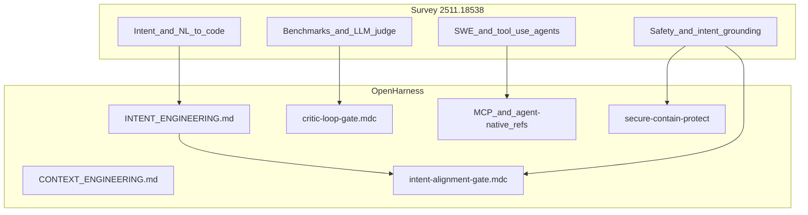

# Gap analysis: arXiv 2511.18538 vs OpenHarness

**Purpose:** Map themes from *From Code Foundation Models to Agents and Applications* (survey) to this harness’s docs and rules, and record **coverage**, **primary files**, and **gaps / next steps**.

---

## Provenance

| Field | Value |
|--------|--------|
| **Title** | From Code Foundation Models to Agents and Applications: A Comprehensive Survey and Practical Guide to Code Intelligence |
| **arXiv** | [2511.18538v5](https://arxiv.org/abs/2511.18538) [cs.SE] |
| **Hugging Face** | [hf.co/papers/2511.18538](https://hf.co/papers/2511.18538) |
| **Local PDF (repo)** | [docs/research/2511.18538v5.pdf](2511.18538v5.pdf) (canonical; ~11 MB) |
| **Digest / TOC source** | Optional: extract first pages to `docs/research/_extract_2511.18538_frontmatter.txt` (gitignored) via `pypdf` |
| **Accessed** | 2026-03-22 (updated 2026-03-22: path moved into `docs/research/`) |

For formal OA metadata by DOI later, use the [research-open-access](../../.cursor/skills/research-open-access/SKILL.md) skill (Unpaywall) if a DOI appears on a publisher version.

---

## Scope of comparison

- **In scope:** Inference-time agent harness: intent, context, handoff, MCP, SCP, critic loop, human gates.  
- **Out of scope:** Training code LLMs, distributed pre-training, RLVR recipes (survey §4–5, §8) — we do not replicate model training; we only note **conceptual** alignment (e.g. “LLM-as-judge” vs our critic).

---

## Gap table

| Paper theme (illustrative) | Harness coverage | Primary files / artifacts | Gap or next step |
|----------------------------|------------------|---------------------------|------------------|
| NL intent → code; human creativity vs. assistance | Strong (intent as primary signal) | [INTENT_ENGINEERING.md](../INTENT_ENGINEERING.md), [state/README.md](../../state/README.md) | Keep intent fields explicit in handoffs; avoid “silent” scope expansion |
| Contextual awareness of large codebases | Partial (retrieval routing, symbols, handoff) | [CONTEXT_ENGINEERING.md](../CONTEXT_ENGINEERING.md), [HANDOFF_FLOW.md](../HANDOFF_FLOW.md), [.cursor/docs/NOGIC_WORKFLOW.md](../../.cursor/docs/NOGIC_WORKFLOW.md) | No built-in repo-scale benchmark; rely on jCodeMunch/Nogic + human scope |
| Benchmarks vs. real-world deployment gap | Partial (verify-not-trust, checklists) | [VERIFY_NOT_TRUST.md](../VERIFY_NOT_TRUST.md), [AGENT_NATIVE_CHECKLIST.md](../AGENT_NATIVE_CHECKLIST.md) | Document “bench ≠ production” when interpreting any eval |
| LLM-as-a-judge (evaluation) | Partial (critic JSON on artifacts) | [.cursor/rules/critic-loop-gate.mdc](../../.cursor/rules/critic-loop-gate.mdc) | Training-time judge ≠ our post-hoc critic; don’t conflate |
| Agent tool use, terminal, UI agents | Strong (MCP, browser skills) | [MCP_TRANSPARENCY.md](../MCP_TRANSPARENCY.md), agent-native refs under `.cursor/skills/agent-native-architecture/` | Keep MCP allowlists and capability map current |
| Model Context Protocol | Mentioned in survey §6.1.2 | Same; [mcp-tool-design.md](../../.cursor/skills/agent-native-architecture/references/mcp-tool-design.md) | — |
| Multi-agent coordination | Partial (policy, handoff chains) | [README.md](../../README.md), multi-agent sections in consumer `.cursorrules` | Deterministic locks / status: follow workspace rules |
| Alignment (SFT/RL) at **training** time | Not applicable | — | **Gap:** harness does not train models; inference-time alignment only |
| Coding safety, red teaming | Partial (SCP, secure-contain-protect) | [.cursor/skills/secure-contain-protect/SKILL.md](../../.cursor/skills/secure-contain-protect/SKILL.md) | Red-team breadth from paper > our default; escalate untrusted code |
| **Runtime oversight and intent grounding** (survey safety §7.4.3) | Addressed (new gate) | [.cursor/rules/intent-alignment-gate.mdc](../../.cursor/rules/intent-alignment-gate.mdc) | Tune `drift_score` / escalation to taste |
| IDE-integrated assistants (§9.1) | Meta (Cursor as host) | — | Practices live in rules/skills, not IDE vendor code |
| Training recipes / scaling (§8) | Not applicable | — | No action in harness |

---

## Value-add patterns, tech, and systems (for our codebases)

This section turns survey themes into **adoption targets**: what to reinforce or add across **OpenHarness**, **portfolio-harness**, and sibling repos (e.g. `software`, `local-proto`, `scp`), without training custom code LLMs.

### Principles from the paper we already mirror

| Survey idea (approx. section) | What to do in our stacks | Primary leverage |
|-------------------------------|--------------------------|------------------|
| NL intent → code (§1) | Keep intent in handoffs, session briefs, product-scope | [INTENT_ENGINEERING.md](../INTENT_ENGINEERING.md), [intent-alignment-gate.mdc](../../.cursor/rules/intent-alignment-gate.mdc) |
| Research vs. deployment gap (§1, §3) | Prefer **executable verification** over benchmark scores for “done” | CI, pytest, `qa-verifier` skill, [VERIFY_NOT_TRUST.md](../VERIFY_NOT_TRUST.md) |
| LLM-as-judge (§3.1.2) | **Critic JSON** + optional intent JSON after substantive outputs | [critic-loop-gate.mdc](../../.cursor/rules/critic-loop-gate.mdc), intent gate |
| Execution-based metrics (§3.1.3) | Treat **tests, linters, typecheck, build** as ground truth for agent work | Pre-commit, CI workflows, Playwright where UI matters |
| Agent tool use / MCP (§3.4, §6.1) | Structured tools, allowlists, transparency docs | [MCP_TRANSPARENCY.md](../MCP_TRANSPARENCY.md), [mcp-tool-design.md](../../.cursor/skills/agent-native-architecture/references/mcp-tool-design.md), portfolio MCP maps |
| Runtime oversight / intent grounding (§7.4.3) | Inference-time **alignment** checks, human gates | [intent-alignment-gate.mdc](../../.cursor/rules/intent-alignment-gate.mdc), `human_gate` in handoffs |
| Safety / untrusted content (§7) | **SCP** before trusting fetched or pasted content | [secure-contain-protect/SKILL.md](../../.cursor/skills/secure-contain-protect/SKILL.md), portfolio `TOOL_SAFEGUARDS` |
| Terminal / IDE / PR-adjacent flows (§9) | Cursor + rules/skills; browser automation for UI; PR review as human gate | [browser-review-protocol](../../.cursor/skills/browser-review-protocol/SKILL.md), role-routing, human approval on merge |

### High-value additions (prioritized)

| Priority | Pattern or system | Why it adds value | Suggested home |
|----------|-------------------|-------------------|----------------|
| P1 | **Verifiable rewards loop** (survey RLVR idea, inference-time) | Map “reward” to **green tests + lint + typecheck** before marking tasks done; reduces bench-only optimism. | CI docs + `qa-verifier`; optional checklist in handoff template |
| P1 | **Dual gates on risky outputs** | Critic (quality) + intent-alignment (scope/constraints) for multi-file and delegation. | Already in [.cursor/rules](../../.cursor/rules); enable in `.cursorrules` where needed |
| P2 | **Repository-level context** | Survey stresses long-repo tasks; we use **jCodeMunch**, **Nogic**, bounded `read_file`, handoff scope—not one giant @. | [CONTEXT_ENGINEERING.md](../CONTEXT_ENGINEERING.md), NOGIC workflow |
| P2 | **MCP hygiene** | Tool explosion risk; keep **capability map**, version pins, least privilege. | [MCP_TRANSPARENCY.md](../MCP_TRANSPARENCY.md); in portfolio-harness see `.cursor/docs/MCP_CAPABILITY_MAP.md` |
| P2 | **Red-team / abuse mindset for agents** | Paper §7.3–7.4; we use SCP + escalation; extend with **security-audit-rules** when changing prompts/skills. | portfolio `security-audit-rules` skill |
| P3 | **Multimodal / UI generation** (§4.4, §9.1) | Relevant to OpenGrimoire and frontend work; use **frontend** skills + visual review, not raw prompt-only UX. | `frontend-a2ui`, browser-review-protocol |
| P3 | **Optional RAG over this PDF** | Only if teams need **semantic search** across 300+ pages; extract text → chunk → SCP → index (e.g. campaign_kb). | YAGNI unless multiple people ask; see brainstorm open questions |

### What we deliberately do not adopt

- **Training/fine-tuning code LLMs** (§2, §4, §8): out of scope for harness repos; use vendor models.  
- **Academic benchmark chasing** as a substitute for product verification: keep **verify-not-trust**.

---

## Code / doc topography (quick map)

---

## Acceptance criteria (for this document)

- [x] Provenance block with arXiv + HF + access date  
- [x] At least five substantive gap rows with harness paths  
- [x] Explicit distinction: critic (quality) vs. intent-alignment (fit to user intent)  
- [x] Value-add section: patterns/systems mapped to repos and priority

---

## Related

- [2026-03-22-code-intelligence-survey-brainstorm.md](../brainstorms/2026-03-22-code-intelligence-survey-brainstorm.md)  
- [BRAIN_MAP_PROCESS_GAP_ANALYSIS.md](../BRAIN_MAP_PROCESS_GAP_ANALYSIS.md) (template style reference)

---

## Implementation notes (concrete repo wiring)

| Priority | Item | Where implemented |
|----------|------|---------------------|
| P1 | Verifiable rewards + dual gates | [HANDOFF_FLOW.md](../HANDOFF_FLOW.md) (Definition of done); portfolio-harness `.cursorrules` (Quality gates + handoff 0a); software `.cursorrules` (Quality gates) |
| P1 | CI alignment | Sibling [portfolio-harness/docs/VERIFICATION_CI_ALIGNMENT.md](../../../portfolio-harness/docs/VERIFICATION_CI_ALIGNMENT.md) (clone layout `D:/portfolio-harness`) |
| P2 | Repo-level context | [CONTEXT_ENGINEERING.md](../CONTEXT_ENGINEERING.md) (Repository-scale context) |
| P2 | MCP hygiene | Sibling [portfolio-harness/.cursor/docs/MCP_CAPABILITY_MAP.md](../../../portfolio-harness/.cursor/docs/MCP_CAPABILITY_MAP.md) |
| P2 | Red-team on rule edits | Sibling `portfolio-harness/.cursorrules` (Rules and skills hygiene); [agent-intent.mdc](../../../portfolio-harness/.cursor/rules/agent-intent.mdc) |
| P3 | Multimodal / UI | Sibling [browser-review-protocol/SKILL.md](../../../portfolio-harness/.cursor/skills/browser-review-protocol/SKILL.md) |
| P3 | RAG on PDF | YAGNI — no ingestion added; PDF remains [2511.18538v5.pdf](2511.18538v5.pdf) |
